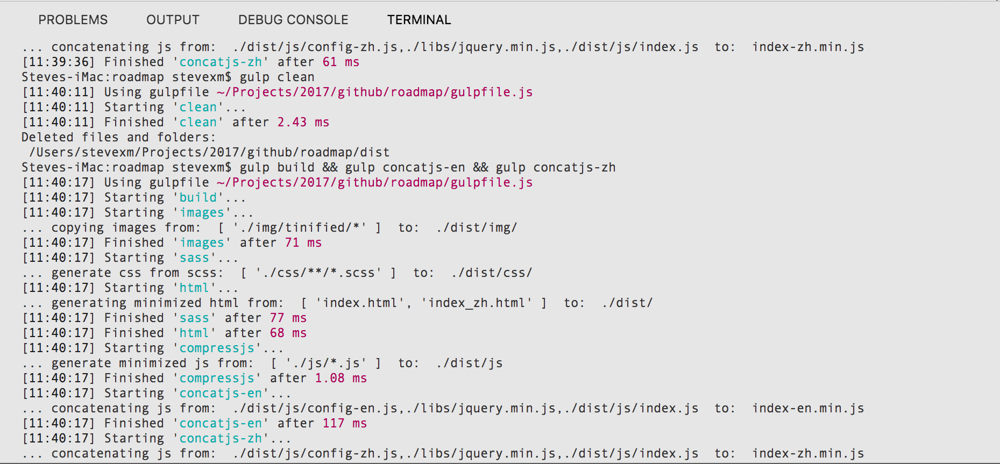

<h1 align="center"> Penta Global Roadmap </h1> <br>
<p align="center">
  <a href="https://penta.global/">
    <!--img alt="GitPoint" title="GitPoint" src="http://i.imgur.com/VShxJHs.png" width="450"-->
    
  </a>
</p>

<h2 align="center">
  The Universal Blockchain Connector
</h2>

## Table of Contents
* [Introduction](#introduction)
* [Installing and Using Gulp](#installing-and-using-gulp)
* [Gulp Packages](#gulp-packages)
* [Gulpfile](#gulpfile)
* [Gulp Tasks](#gulp-tasks)
* [Penta Gulp Tasks](#penta-gulp-tasks)

<!-- END doctoc generated TOC please keep comment here to allow auto update -->

## Introduction
Great build tools and smart automation can make for great technology. This GitHub repo contains the Penta Global roadmap website sources. 

From the Google PWA training <a href="https://developers.google.com/web/ilt/pwa/introduction-to-gulp" target="_blank">website</a>:
>Modern web development has many repetitive tasks like running a local server, minifying code, optimizing images, preprocessing CSS and more.

Same for Penta, which uses Gulp as a build system to automate common tasks, such as compiling preprocessed CSS, minifying JavaScript and reloading the browser (todo).

## Installing and Using Gulp
The Google PWA <a href="https://developers.google.com/web/ilt/pwa/introduction-to-gulp" target="_blank">website</a> has a great walkthrough of how to install and get started with Gulp:

### What is gulp?
Gulp is a cross-platform, streaming task runner that lets developers automate many development tasks. At a high level, gulp reads files as streams and pipes the streams to different tasks. These tasks are code-based and use plugins. The tasks modify the files, building source files into production files. To get an idea of what gulp can do check the list of gulp recipes on GitHub.

### How to set up gulp
Setting up gulp for the first time requires a few steps.

### NodeJS
Gulp requires <a href="https://nodejs.org/en/" target="_blank">Node</a>, and its package manager, <a href="https://www.npmjs.com/" target="_blank">npm</a>, which installs the gulp plugins.

If you don't already have Node and npm installed, you can install them with Node Version Manager (nvm). This tool lets developers install multiple versions of Node, and easily switch between them.

>Note: If you have issues with a specific version of Node, you can switch to another version with a single command.

Nvm can then be used to install Node by running the following in the command line:
```
(sudo) nvm install node
```
This also installs Node's package manager, npm. You can check that these are both installed by running the following commands from the command line:
```
node -v
npm -v
```
If both commands return a version number, then the installations were successful.

Gulp command line tool
Gulp's command line tool should also be installed globally so that gulp can be executed from the command line. Do this by running the following from the command line:
```
(sudo) npm install --global gulp-cli
```
## Gulp Packages
Gulp and Node rely on plugins (packages) for the majority of their functionality. Node plugins can be installed with the following command line command:
```
(sudo) npm install pluginName --save-dev
```
This command uses the npm tool to install the pluginName plugin. Plugins and their dependencies are installed in a node_modules directory inside the project's working directory.

The --save-dev flag updates package.json with the new package.

The first plugin that you want to install is gulp itself. Do this by running the following command from the command line from within your project's working directory:
```
npm install gulp --save-dev
```
>Note: whenever a package is installed this way with the --save or --save-dev flags the dependency will be written to the package.json file so all packages can be updated at any future time with:
```
npm update [-g] [<pkg>...]
```
>Or to reinstall everything listed as a dependency from package.json use:
```
npm install (with no args, in package dir)
npm install [<@scope>/]<name>
npm install [<@scope>/]<name>@<tag>
npm install [<@scope>/]<name>@<version>
npm install [<@scope>/]<name>@<version range>
npm install <git-host>:<git-user>/<repo-name>
npm install <git repo url>
npm install <tarball file>
npm install <tarball url>
npm install <folder>

alias: npm i
common options: [-P|--save-prod|-D|--save-dev|-O|--save-optional] [-E|--save-exact] [-B|--save-bundle] [--no-save] [--dry-run]
```
>**Important Note:** Whenever the roadmap repo is committed to GitHub the contained .gitignore file has the upload action not copy anything in /node_modules. This means than the first time a local copy of the roadmap repo is made from GitHub (*checkout*) **npm install** needs to be run so that everything listed in package.json will be reinstalled into node_modules.

Gulp and its dependencies are then present in the the node_modules directory (inside the project directory). The package.json file is also updated to the following (your values may vary):
```
package.json
{
  "name": "test",
  "version": "1.0.0",
  "description": "",
  "main": "index.js",
  "scripts": {
    "test": "echo \"Error: no test specified\" && exit 1"
  },
  "author": "",
  "license": "ISC",
  "devDependencies": {
    "gulp": "^3.9.1"
  }
}
```
>Note: there is now a devDependencies field with gulp and its current version listed.

## Gulpfile
Once packages are installed (in node_modules), you are ready to use them. All gulp code is written in a gulpfile.js file. To use a package, start by including it in gulpfile.js. The following code in your gulpfile includes the gulp package that was installed in the previous section:
```
gulpfile.js
var gulp = require('gulp');
```
## Gulp Tasks
Gulp tasks are defined in the gulpfile.js file using gulp.task. A simple task looks like this:
```
gulpfile.js
gulp.task('hello', function() {
  console.log('Hello, World!');
});
```
This code defines a *hello* task that can be executed by running the following from the command line:
```
gulp hello
```
A common pattern for gulp tasks is the following:
1. Read some source files using gulp.src
2. Process these files with one or more functions using Node's pipe functionality
3. Write the modified files to a destination directory (creating the directory if doesn't exist) with gulp.dest
```
gulp.task('task-name', function() {
  gulp.src('source-files') // 1
  .pipe(gulpPluginFunction()) // 2
  .pipe(gulp.dest('destination')); // 3
});
```
A complete gulpfile might look like this:
```
gulpfile.js
// Include plugins
var gulp = require('gulp'); // Required
var pluginA = require('pluginA');
var pluginB = require('pluginB');
var pluginC = require('pluginC');

// Define tasks
gulp.task('task-A', function() {
  gulp.src('some-source-files')
  .pipe(pluginA())
  .pipe(gulp.dest('some-destination'));
});

gulp.task('task-BC', function() {
  gulp.src('other-source-files')
  .pipe(pluginB())
  .pipe(pluginC())
  .pipe(gulp.dest('some-other-destination'));
});
```
Where each installed plugin is included with require() and tasks are then defined using functions from the installed plugins. Note that functionality from multiple plugins can exist in a single task.

## Penta Gulp Tasks

To automate the workflow for building the Penta Roadmap there are a number of self-contained utility tasks to use.
>Note: All output from a Penta gulp task is written to **/dist**.
- hello - general purpose 'hello world' task to test Gulp installation with
```
gulp hello
// returns 'Hello World'
```
- build - general workflow build process pipeline. Executes tasks: ico, images, sass, html, and compressjs in parallel.
```
gulp build
// copies ico.png 
```
- clean - deletes the */dist* directory, all files and subdirectories within.
```
gulp clean
// delete the /dist directory and contents
```
- clean - deletes the */dist* directory, all files and subdirectories within.
```
gulp clean
// delete the /dist directory and contents
```
- clean - deletes the */dist* directory, all files and subdirectories within.
```
gulp clean
// delete the /dist directory and contents
```
- ico - copy favicon ico.png to */dist* directory.
```
gulp ico
// copy ico.png to /dist
```
- images - copy all the pre-optimized .png images from /img/tinified to /dist. Optimize any .svg files and copy from /img/tinified to /dist.
>Note: All the raw .png images in /img are pre-optimized using the free, online <a href="https://tinypng.com/" target="_blank">tinypng</a> service, and the resulting compressed files are then copied to /img/tinified along with any raw .svg files. SVG files are optimized *on the fly* by the images task using the <a href="https://github.com/svg/svgo" target="_blank">svgo</a> gulp package.
```
gulp images
// delete the /dist directory and contents
```
- sass - generates all css and .map from the scss in /css and copies the optimized css output to /dist/css
```
gulp sass
// generates all css and .map from the scss
```
- html - generates optimized html and copies the output index.html and index_zh.html to /dist
```
gulp html
// generates optimized index.html and index_zh.html and copies both to /dist
```
- compressjs - compresses all .js and copies the optimized to /dist/js
```
gulp compressjs
// compress all javascript
```
>Note: By default, Gulp runs tasks simultaneously, unless they have explicit dependencies. This complicates matters for the following tasks concatenation tasks as they need compressjs to have completed beforehand. To keep things as simple as possible, they are not part of the build task and are run independently after the build task.

>Note: *future TODO is install the run-sequence Gulp package and implement a fully automated workflow build pipeline that includes js file concatenation.*

- concatjs-en - concatenate /dist/js/config-en.js, /libs/jquery.min.js, and /dist/js/index.js into a single file: /dist/js/index-en.min.js . This optimizes load time(s) as only a single network request is made instead of three.
```
gulp concatjs-en
// concatenate /dist/js/config-en.js, /libs/jquery.min.js, and /dist/js/index.js
```
- concatjs-zh - For the Chinese language version, concatenate /dist/js/config-zh.js, /libs/jquery.min.js, and /dist/js/index.js into a single file: /dist/js/index-en.min.js . This optimizes load time(s) as only a single network request is made instead of three.
```
gulp concatjs-zh
// concatenate /dist/js/config-zh.js, /libs/jquery.min.js, and /dist/js/index.js
```



## Feedback

Feel free to send us feedback by [filing an issue](https://github.com/pentaglobal/roadmap/issues/new). Feature requests are always welcome. 

## Penta Team Contributors

<a href="https://github.com/mark0725" target="_blank"></a>
<a href="https://github.com/pentaadmin" target="_blank"></a>
<a href="https://github.com/stevexm" target="_blank"></a>

## To Do

- Add [livereload server](https://github.com/vohof/gulp-livereload) as part of the workflow
- Add [remote deploy task](https://gist.github.com/plasticbrain/b98b5c3b97e7226353ce)
- Add semver [versioning bumping task](https://github.com/stevelacy/gulp-bump
) 

## Acknowledgments
Thanks to the Penta dev and web teams!
